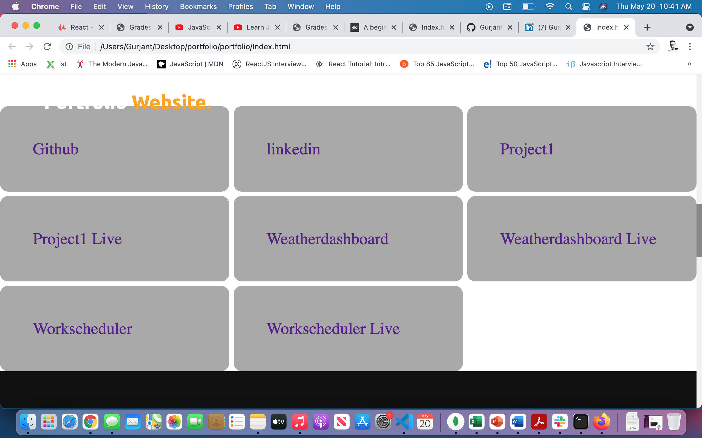
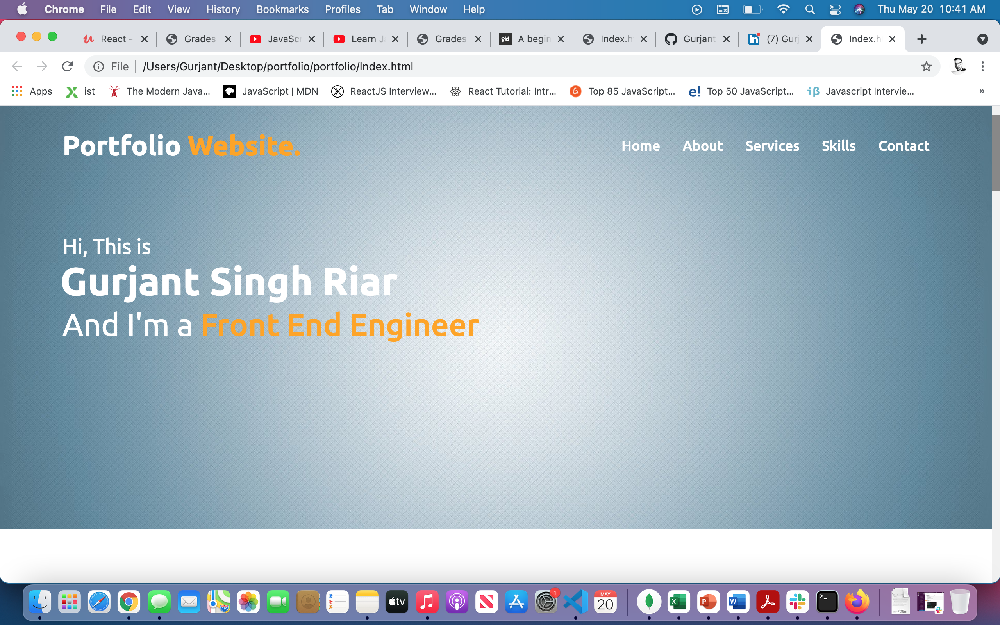
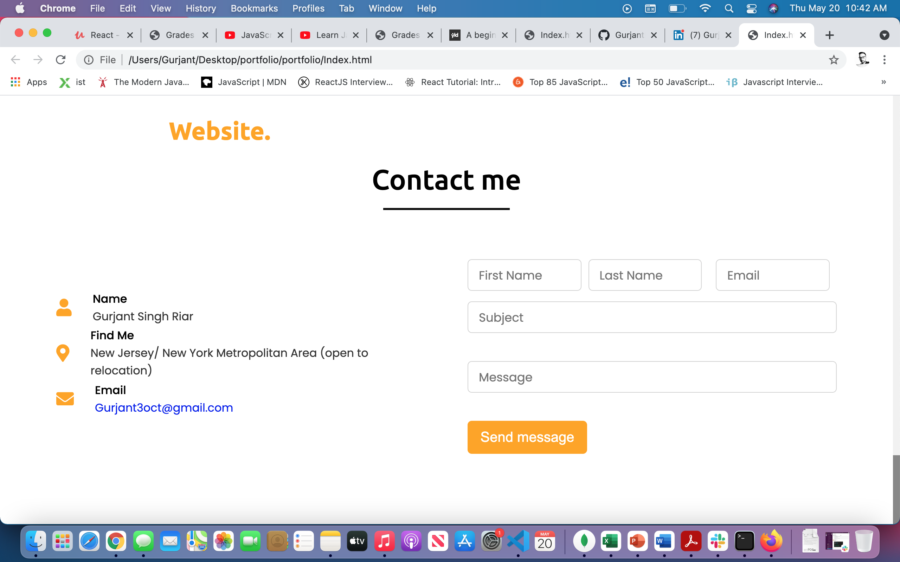

# portfolio# uconnbootcamp-homework1
UConn coding boot camp homework 1 -  HTML, CSS, Git: Code Refractor.

# 
## Project Overview:
Horiseon is a company that already has a webpage built.  They would like to refactor their webpage to be more compatiable with search engines and more visually appealing to the viewer/clients.  There are various techinical issues to be resolved on html and css.
 
#
## Project Goals:
1. Improve the websites searchability by administering proper elements.  Most of the page uses the divide element to seperate.  This will impede the sites searchability.  Replace any divide elements with proper ones based on page content.   
2. Repair any broken links/formatting issues.  All images in html do not have alternate names.  Ensure all the links in navigation work properly. 
3. Make the website more visually appealing by adding a name to head and using heart icon from below as favicon.
4. Optimize code on css style sheet by combining repeating coding.  While the css code works, much of it is redundant, and can be combined using proper class targets. 

# 

# 

# 

# 

## Contributors
[Gurjant Riarl](https://github.com/GurjantRiar/QuizGame/
)

# 
## Built With:
[Visual Studio](https://visualstudio.microsoft.com/)

[CSS](https://www.w3.org/TR/CSS/#css)

# 
## Links:
[Email](pratikpatel_85@yahoo.com)

[Github Profile](https://github.com/GurjantRiar/
)

